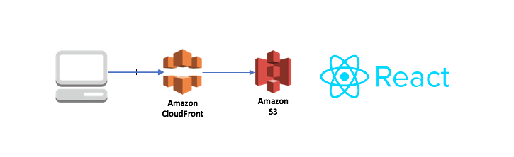
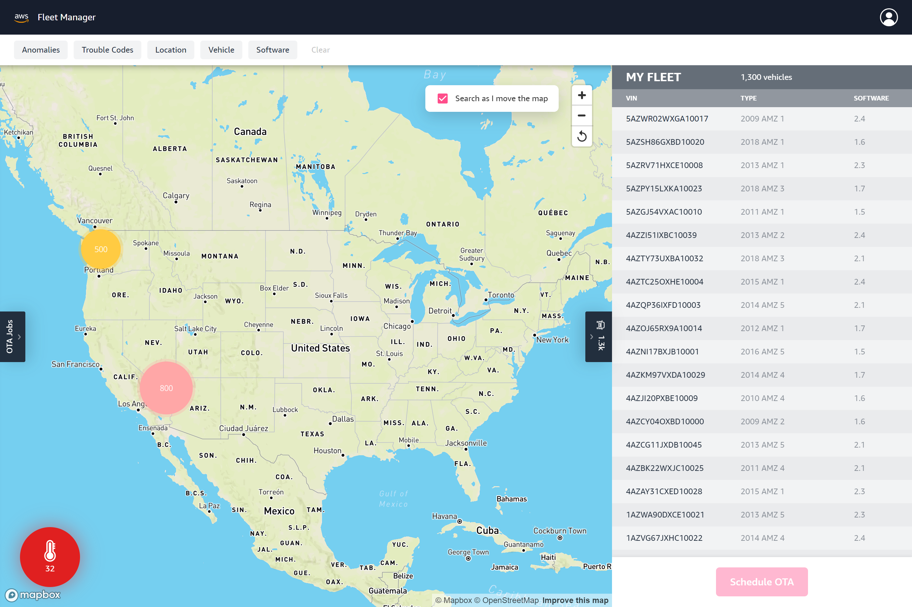
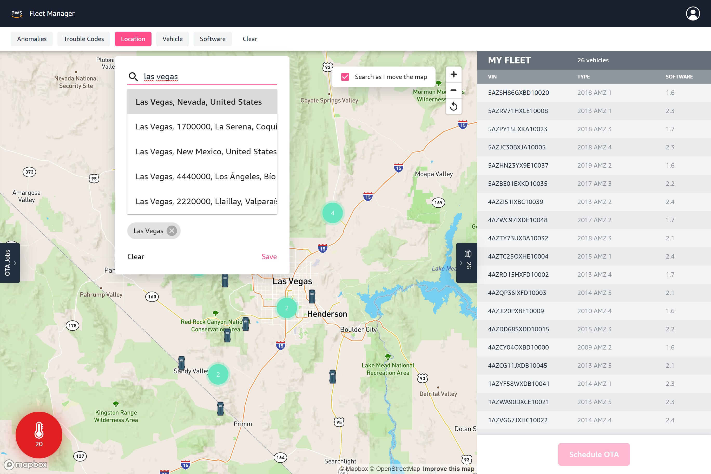
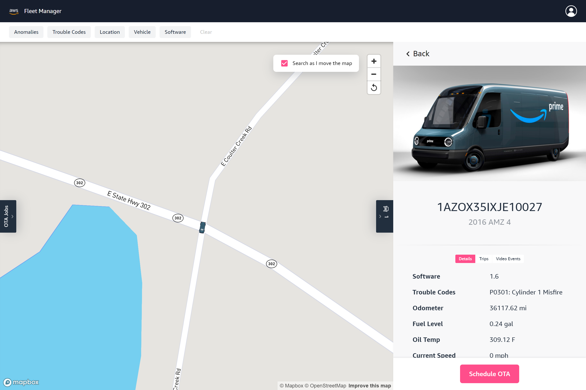
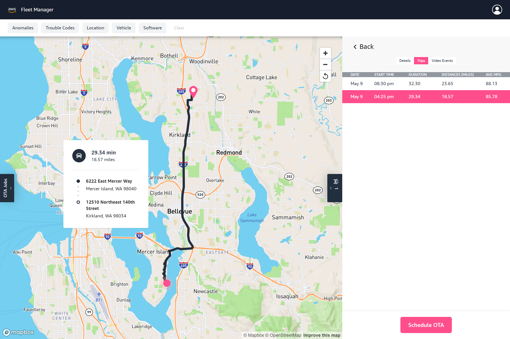
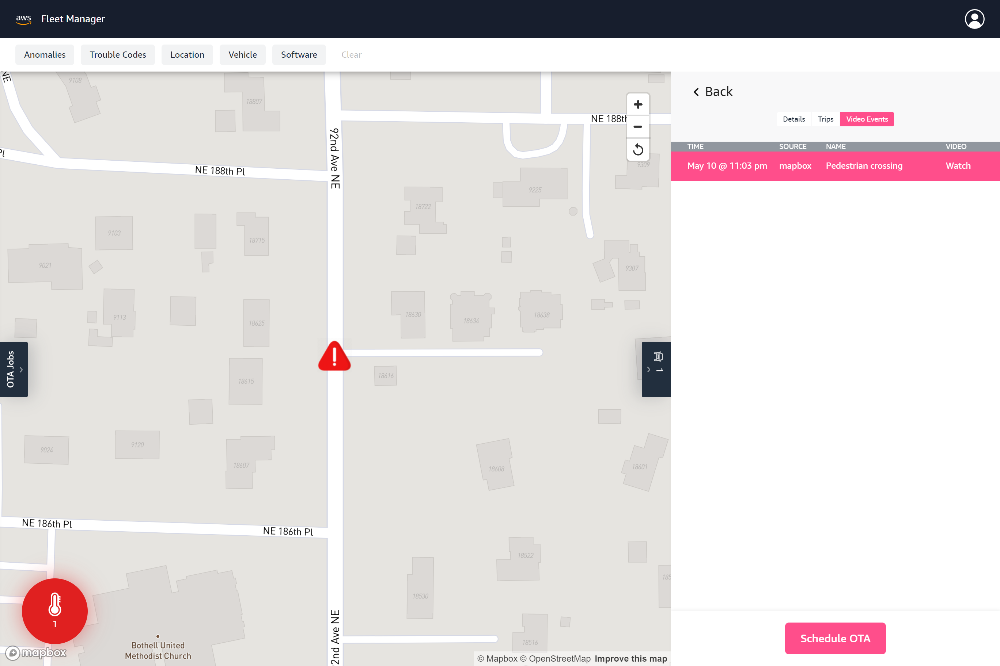
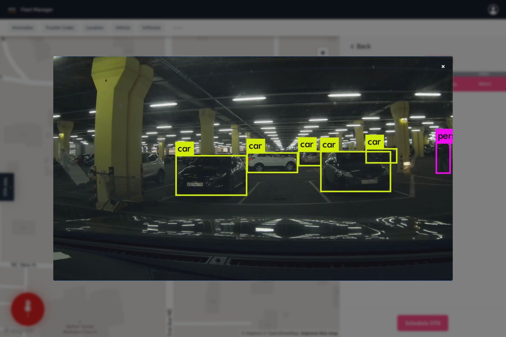
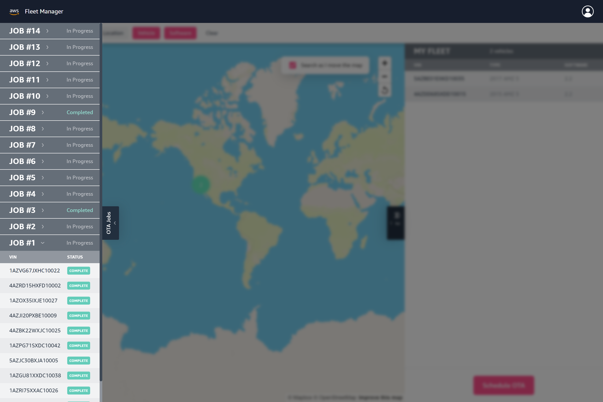

# Connected Mobility

## Solution Integration Notes

Deployment of this UI is modeled after the IoT Device Simulator Solution, where a public bucket will contain pre-compiled artifacts that a custom resource helper will use to copy files to a bucket in the customer's account. After copying artifacts, the helper will create and PUT a configuration file `assets/appVariables.js` in the customer's S3 bucket. This allows the UI to communicate with the customer's Cognito and API Gateway resources.

A custom resource is already implemented here, as well as a file manifest generator that is invoked after compiling the UI artifacts.

The only remaining tasks are

1. Update the values of `mappings` in the template with the correct bucket and folder names that will contain the UI artifacts
2. Replace hard-coded values with empty strings in /public/assets/appVariables.js

The following parameters are required for this template:

```
DestinationBucket -- name
UserPoolId
UserPoolClientId
CDFAutoEndpoint -- id (e.g. 1befuylil6)
```

## UI Technical Documentation

### Architecture



- CloudFront

- CloudFront Origin Access Identity

- S3

### File Structure

```
|-infrastructure/
  |-helper/                        [ Helper resource for deployment and configuration of UI ]
    |-lib/                         [ Helper resource libraries ]
    |-index.js                     [ Node.js handler ]
  |-cfn-cdf-auto-ui-deployment.sh  [ CloudFormation deployment template for UI ]
  |-package-cfn.bash               [ Bash script for packaging UI template ]
  |-deploy-cfn.bash                [ Bash script for deploying UI template ]

|-public/
  |-assets/                        [ Folder for non-compiled assets ]
    |-img/                         [ Images ]
    |-video/event.mp4              [ Video for vehicle events ]
    |-appVariables.js              [ JavaScript configuration values for UI ]
  |-index.html                     [ HTML for modifying page title ]

|-src/
  |-actions/                       [ Redux actions ]
  |-apis/                          [ API definitions ]
  |-assets/                        [ CSS, fonts, images, mappings and other static assets ]
    |-appConfig.js                 [ App configuration and settings ]
  |-components/                    [ UI React components ]
  |-store/                         [ Redux store and reducers ]
  |-utils/                         [ JavaScript helpers ]
```

### Solution Bootstrap

[Create React App](https://create-react-app.dev/docs/getting-started/) was used to bootstrap development of the UI.

### Major Libraries

- React: UI
- Redux: State management
- React Router: Navigation/routing
- Material UI: CSS-in-JS styling, pre-built elements
- React Map GL: Mapbox wrapper
- AWS Amplify: Authentication, REST client
- AWS Amplify React: Login/Reset/Verify components

### Note on Environmental Variables

If environmental variables are used, they must be prefixed with `REACT_APP_`

Example: REACT_APP_MAPBOX_KEY

### Available Scripts

#### `npm start`

Runs the app in the development mode.<br>
Open [http://localhost:3000](http://localhost:3000) to view it in the browser.

The page will reload if you make edits. You will also see any lint errors in the console.

#### `npm test`

Launches the test runner in the interactive watch mode.

#### `npm run build`

Builds the app for production to the `build` folder.<br>
It correctly bundles React in production mode and optimizes the build for the best performance.

The build is minified and the filenames include the hashes.

### site-manifest.json

After running the build script, `generate-manifest.js` will run and produce a list of of the build files in the `build` directory.

### Application Configuration Values

Emulating the IoT Device Simulator Solution, essential configuration values are contained in `/public/assets/appVariables.js` as a global object. This file is then included as a `<script>` tag by `index.html`.

After this, the next step is `/src/assets/appConfig.js`, which references the global appVariables object and exports additional values which define the behavior of the UI:

- ANOMALY_COUNT_THRESHOLD - number that determines when the red circle icon for anomalies appears over the map

- JOB_EXECUTIONS_REFRESH_INTERVAL - refresh rate when viewing the details of a particular OTA job (milliseconds)

- ZOOMED_IN_THRESHOLD - number representing zoom level that determines when the UI will switch to "zoomed in" mode, enabling frequent data refresh rate and moving vehicle animations (0 - 24)

- DEFAULT_UPDATE_INTERVAL - refresh rate when not in "zoomed in" mode (milliseconds)

- ZOOMED_UPDATE_INTERVAL - "zoomed in" refresh rate (milliseconds)

- SINGLE_FEATURE_ZOOM_LEVEL - number determining level of "auto zoom in" (0 - 24)

### Note on User Management

This solution creates a single user upon deployment and disallows app sign up. Additional users can only be created by administrators from the AWS Console or CLI for the Cognito User Pool **cdf-auto-users**.

If desired, the UI can be modified to enable Sign Up functionality provided by AWS Amplify React in the following files: `AppWithAuth.jsx` and `LandingPage.jsx`

## UI Overview

This solution provides a web-based graphical user interface (GUI) console that enables customers to track a fleet of connected vehicles; view telemetry, previous trips and vehicles events; search and filter by location and vehicle attributes, as well as creating OTA jobs.

#### World Map View

The Fleet Manager features a world map displaying the last known location of vehicles, with proximity clustering based on zoom levels. A paginated list of vehicles corresponding to the map view is also available.

A red circle icon indicates the number of vehicles reporting an oil temperature anomaly.



#### Vehicle Filtering

Vehicle results can be filtered by multiple criteria such as geo-location boundaries, reported anomalies and trouble codes, vehicle attributes and software version.



#### Single Vehicle View

The latest telemetry and attributes of a single vehicle can be displayed by making a selection from the map or vehicle list.



#### Trip History View

A vehicle's trip history can be viewed as a list and route information rendered on the map.



#### Events View

Reported vehicle events can also be displayed by location and video links can be played back in the UI.





#### Create OTA Job

OTA Jobs can be created for multiple vehicles based on filter selections, as well as for individual vehicles by using the single vehicle view.


#### OTA Job Status

The status of all OTA Jobs can be viewed in the left sidebar.



### Authentication

This solution takes advantage of the user authentication features of Amazon Cognito User Pools. After successfully authenticating a user, Amazon Cognito issues a JSON web token that is used to allow the console to submit requests to the Connected Mobility API. HTTPS requests are sent by the console with an authorization header that includes the token.

## Getting Started

### Accessing Connected Mobility

After you deploy the solution, sign into the Connected Mobility website using the link in the email invitation you receive. When you sign in to the console for the first time, use the temporary password that is included in the email invitation. You will be prompted to change your password upon successful authentication.

### Add a Mapbox Token

This solution leverages the location features of Mapbox to provide a map for your fleet of vehicles. To use the Fleet Manager, you must register for a free Mapbox developer account. After you register, add your Mapbox token to the Connected Mobility website.

1. After login, the console will display a warning about a missing Mapbox token.
2. Enter your Mapbox token in the input box.
3. Select the checkmark icon or press the "Enter" key.
4. Upon token verification, the map will load.

### Filtering Vehicles

The following categories are available for filtering vehicles:

- Anomalies
- Trouble Codes
- Location
- Vehicle Attributes
- Software Version

Applying multiple categories of filters will provide **AND** results.

Within each category, several options may be available. In the Vehicle filter, four sub-categories exist: VIN, Make, Model and Year.

Selecting multiple options with a single (sub-)category will results in **OR** results.

Applying multiple sub-category filters in Vehicle will result in **AND** results. E.g. Make **_AMZ_** AND Year **_2020_**.

Location filtering is based on geo-location bounding boxes.

### Creating an OTA Job

#### Single Vehicle OTA Job

When viewing the details of a specific vehicle in the right sidebar, clicking on **Schedule OTA** will start the OTA Job creation process.

Select a desired Software Version and then select **Deploy Now**.

#### Creating OTA Job by Filters

OTA Jobs can be created for multiple vehicles by using any combination of the following filters: Trouble Codes, Vehicle, and Software. At this time, only one option per filter sub-category is currently supported.

All fleet vehicles matching the selected filters will be targeted for the OTA Job.

### Viewing Status of OTA Jobs

Th left sidebar contains a list of all OTA Jobs and their progress. Selecting an individual job will display the individual execution status of each vehicle in the OTA Job.

### Changing Your Mapbox Token

1. When logged on to the Fleet Manager, select the **User Avatar Icon** in the navigation bar.
2. Select the **Pencil Icon** to enable the input box.
3. Enter your Mapbox token.
4. Select the **Checkmark Icon** or press the "Enter" key to save.

## Amazon CloudFront

This solution deploys a static website hosted in an Amazon S3 bucket. To help reduce latency and improve security, this solution includes an Amazon CloudFront distribution with an origin access identity, which is a special CloudFront user that helps restrict access to the solution’s website bucket contents. For more information, see Restricting Access to Amazon S3 Content by Using an Origin Access Identity.
